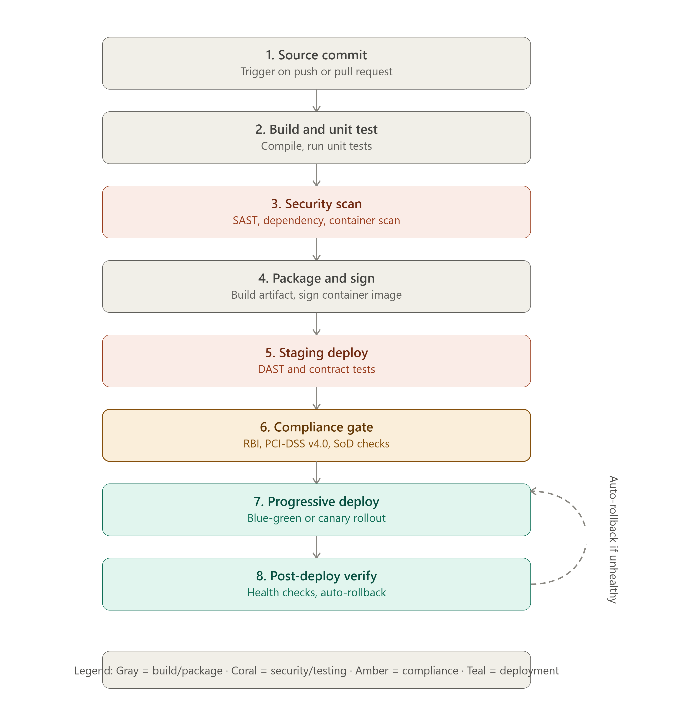

# NovaPay Digital Bank — Zero-Downtime CI/CD Pipeline Architecture

## AI Attribution
This document was developed with AI assistance (Claude) for drafting, research 
synthesis, and technical writing. All architectural decisions, tool selections, and 
final content were reviewed and understood by the author.

## Toolchain Summary
- CI/CD Engine: GitHub Actions
- GitOps: ArgoCD
- Service Mesh: Istio
- IaC: Terraform + Helm
- Container Registry: JFrog Artifactory
- Policy Engine: OPA/Kyverno

## The Eight Canonical Pipeline Stages

### Stage 1: Source Control & Trigger
- **Branch strategy:** Trunk-based development — feature branches live < 24 hours, merge via short-lived PRs
- **Triggers:** Webhook on push, PR creation, and tag events
- **Controls:** Signed commit verification (GPG/SSH), branch protection preventing direct pushes to `main`
- **Emergency path:** Hotfix branches get expedited review but go through ALL security/compliance gates — never bypassed
- **Inputs:** Developer commit | **Outputs:** Validated, signed commit on trigger branch
- **Failure mode:** Unsigned commit → rejected at push; direct push to main → blocked by branch protection
- **SLA target:** < 1 minute to trigger pipeline

### Stage 2: Build & Compilation
- **Method:** Multi-stage Docker builds with layer caching
- **Testing:** Unit tests with minimum coverage thresholds — 80% line, 70% branch
- **Versioning:** SemVer (MAJOR.MINOR.PATCH+build_metadata) including Git SHA, build timestamp, CI run ID
- **Rule:** Container images tagged with SemVer + Git SHA — never `latest` in production
- **Inputs:** Signed commit | **Outputs:** Versioned, tested build artifact
- **Failure mode:** Any unit test failure or coverage below threshold → pipeline blocked
- **SLA target:** 10 minutes

### Stage 3: Static Analysis & SAST
- **Tool:** SonarQube with custom banking rules (PII handling, encryption usage, SQL injection patterns)
- **Thresholds:** 0 Critical, ≤2 High findings, technical debt ratio ≤5% for new code
- **Inputs:** Build artifact source | **Outputs:** SAST pass/fail report
- **Failure mode:** Any Critical finding, or >2 High findings → pipeline blocked, auto-ticket created
- **SLA target:** 8 minutes

### Stage 4: Dependency & Container Scanning
- **Tools:** Trivy (container images), SBOM generation in CycloneDX format
- **Thresholds:** 0 Critical CVEs; High CVEs blocked if CVSS > 8.0
- **Additional checks:** Licence compliance (GPL/AGPL/SSPL blacklist), base image provenance verification
- **Inputs:** Built container image | **Outputs:** SBOM + vulnerability report
- **Failure mode:** Critical CVE detected → pipeline blocked; 72-hour remediation window for exceptions
- **SLA target:** 6 minutes (runs parallel with Stage 3)

### Stage 5: Integration & Contract Testing
- **Tools:** Pact (consumer-driven contract testing)
- **Method:** Ephemeral namespace provisioning for isolated testing, database integration testing with managed test data
- **Additional checks:** API backward compatibility verification, performance baseline establishment
- **Inputs:** Signed, scanned artifact | **Outputs:** Integration test report + contract verification
- **Failure mode:** Any contract verification failure → pipeline blocked (breaking API change detected)
- **SLA target:** 10 minutes

### Stage 6: Dynamic Analysis & DAST
- **Tool:** OWASP ZAP — both active and passive scanning, authenticated scanning with secure test credentials
- **Scope:** API-specific scanning using OpenAPI/Swagger spec as input
- **Thresholds:** 0 Critical/High findings from OWASP Top 10
- **Inputs:** Deployed staging instance | **Outputs:** DAST vulnerability report
- **Failure mode:** Any Critical/High OWASP Top 10 finding → pipeline blocked; formal risk acceptance + TRC review required for exception
- **SLA target:** 15 minutes

### Stage 7: Policy & Compliance Gates
- **Tools:** OPA/Kyverno (Kubernetes policy), Cosign (image signing/provenance)
- **Controls:** RBI technology risk codification, PCI-DSS automated checks (network segmentation, encryption), segregation of duties enforcement
- **Rule:** Kubernetes admission controller rejects any unsigned container image
- **Inputs:** Compliance-relevant metadata + signed image | **Outputs:** Compliance gate pass/fail + audit record
- **Failure mode:** Policy violation → deployment rejected; dual approval required to override
- **SLA target:** 20 minutes (includes approval step)

### Stage 8: Deployment & Verification
- **Method:** Blue-green or canary execution (see Deliverable 2 for full detail)
- **Verification:** Post-deployment smoke test suite, synthetic transaction monitoring
- **Rollback:** Automated rollback trigger conditions (see Deliverable 6)
- **Inputs:** Compliance-approved artifact | **Outputs:** Live production deployment + verification report
- **Failure mode:** Health check failure or metric breach → automatic rollback triggered
- **SLA target:** 40 minutes (includes canary bake time)

## Parallel Execution Opportunities
Stages 3 (SAST) and 4 (Dependency/Container scan) run **in parallel** — both operate on 
the build artifact independently. This is critical to meeting the sub-2-hour commit-to-
production target (see Deliverable pipeline velocity analysis).

## Total Estimated Pipeline Duration
Sequential critical path: ~1 + 10 + 8 + 10 + 15 + 20 + 40 ≈ **104 minutes**, within the 
required 2-hour (120-minute) target, with margin for minor delays.
